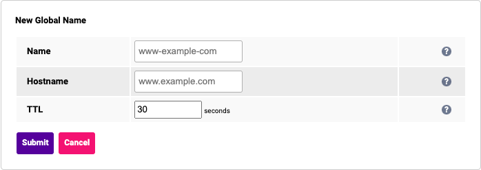

# Global Names

Global names are the FQDNs that the GSLB will be responding to requests on. They must correspond to the configuration
that was set in the DNS infrastructure. To create a "New Global Name" you must navigate to "Cluster Configuration > GSLB
Configuration > Global Names". From there you can click the "New Global Name" button and you will be presented with the
following form.

A new global name requires these three options to be configured.

- **Name:** a local reference to the global name and is not used in the consideration of any parts of the GSLB process.
  It must be an XML-safe string.
- **Hostname:** the fully-qualified domain name that the GSLB is sending responses on behalf of.
- **TTL:** the Time To Live for the DNS record. DNS TTL represents the amount of time that a DNS response will be cached
  by the requester's system.