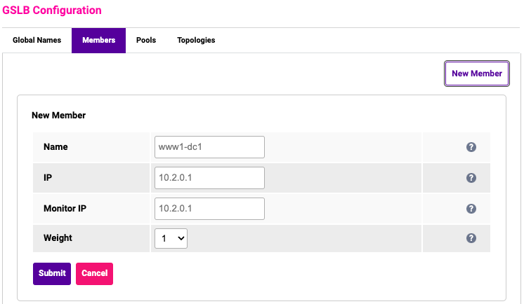

# Members

Members are the individual IP addresses that a request can be resolved to. Members are associated with Pools and they
can be assigned to multiple pools but typically a member is only a member of a single pool. To create a new member you
must navigate to "Cluster Configuration > GSLB Configuration > Members". Once there, you click on the "New Member"
button, and you will be presented with a form to provide the information.

- **Name:** a local reference to the member that is displayed in the GSLB configuration and is not used in the
  consideration of any parts of the GSLB process. It must be an XML-safe string.
- **IP:** the IP address of the member. This is usually a VIP address but can also be a Node IP if implementing SDNS, as
  detailed below.
- **Monitor IP:** the IP address that the health check will be performed against. If this field is left empty then the
  value will default to the IP address. This should be left empty unless you specifically want to perform health checks
  against an IP address that is different from the member IP.
- **Weight:** the relative frequency that this particular member should be resolved in comparison to the other members
  in the pool.

#### Member IPs

Typically and historically, the IP that is configured for a member is the VIP for the Virtual Service that you are
performing GSLB for. With increasing frequency we are seeing a requirement for the Member IPs to be configured as the
node server IPs themselves. When the GSLB is configured in this way it is referred to as SDNS (Smart DNS), previously
this was called GSLB direct-to-node.